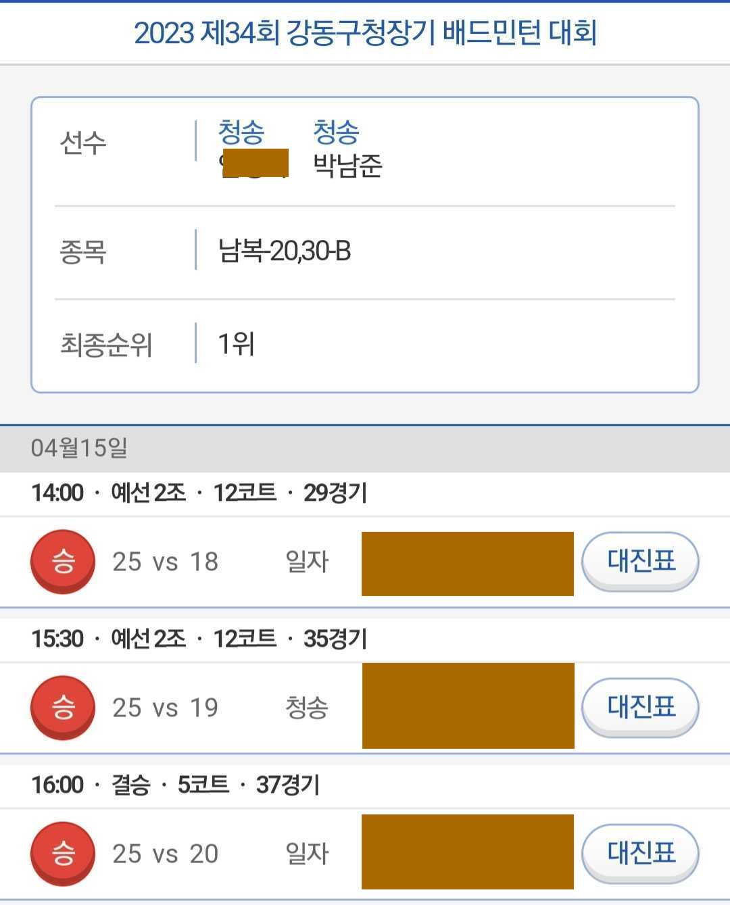

2023년에 대한 회고를 진행해보려고 한다. 2023년은 나름 굵직한 일들이 있었는데
2022년에 계획했던 2023년 계획을 바탕으로 회고를 해보려고 한다.

## 2023년 계획

1. 백엔드 주니어로 1인분 하기
2. 나만의 서비스 런칭하기
3. 배드민턴 A조 + 몸관리
4. 영어 공부 제대로 시작하기

## 1. 백엔드 주니어로 1인분 하기

프론트엔드, 백엔드 하나 제대로 하기도 벅차지만 개발자라면 풀스택을 지향해야 한다고 생각한다.
특히나 요새 Next.js와 같은 SSR 프레임워크가 나오면서 프론트엔드 개발자도 백엔드 영역을 잘 알아야
올바른 프론트엔드 아키텍처를 설계할 수 있다. 반대로 혼자서 모든것을 개발하는 괴물이 아닌 이상
프론트엔드 개발을 모르는 백엔드 개발자도 좋은 협업을 할 수 없다고 생각한다. 또, 나는 언젠가는 나만의 규모있는 서비스를 만들기 싶기 때문에
프론트엔드부터 백엔드, 인프라까지 혼자 개발할 수 있는 개발자가 되고 싶었다.

기존에 유지보수 해오던 B2C 프로덕트의 방향과 회사의 전반적인 방향이 바뀌기 시작하면서
회사에서 FE개발자 보다는 BE개발자가 훨씬 많이 필요하다고 생각했다. 또, 회사에서 크고 작게 팀이 해체되거나 합쳐지는 상황에서 개개인들이
원하는 일을 할 수 있게끔 하겠다고 선언했다. 그래서 나는 BE개발자로 전향하기로 했다. 역시나 생각과는 다르게 BE로 전향하는 과정이 쉽지는 않았다.
새로 옮기게 된 팀의 TPM님께서 많은 도움을 주셔서 수개월간 협상을 거쳐 BE개발자로 전향할 수 있게 되었다. 너무 많은 도움을 받아 아직도 제대로 보답해드리지 못했지 모르겠지만
이런 큰 도움을 받은 기억을 항상 간직하려고 노력하고 있다.

기대는 크게 안 하셨겠지만 시니어 TO 대신에 아무것도 모르는 내가 팀에 들어가게 되어 압박감이 있었다. Express.js, MongoDB로 백엔드 토이 프로젝트는 진행한 적이 있었지만 사실 백엔드 개발자로서의
경험은 없었다. Python, FastAPI, SqlAlchemy, Pytest, Docker, AWS ECS 등 (사실 훨씬 많은 것들을 다루고 있다.) 모두 처음 접하는 기술이라 더욱 어렵게 느껴졌다. 다행히 내
사수분께서 많은 도움을 주셨고 운 좋게 첫번째 프로젝트를 잘 마무리했고 지금도 유지보수 하고 있다. 난 여러모로 복 받았다.

그래서 나는 백엔드 개발자로 1인분 하고 있나?라고 물어보면 아직은 아니라고 생각한다. 물론 주어진 일을 기한보다 항상 빠르게 끝내고 있다. 하지만 개발자가 1인분을 하고 있다는 것은
팀원들이 중요한 프로젝트를 나에게 맡겼을때 안정감이 들면 1인분한다고 생각한다. 아직은 그정도의 케파는 아니다. 대신 FE 작업도 같이 병행하며 1인분을 채워가고 있다. 나의 커리어에 있어 당장
도움이 되지는 않다고 생각하지만 팀에 병목이 될 수 있는 부분들을 나름대로 잘 해결헀다. 이런 부분들이 앞으로 나와 앞으로도 같이 일하게 될 팀원들에게 분명히 도움이 될 것 같다.

## 2. 나만의 서비스 만들기

출처: 팀 스파르타 홈페이지

결과적으로 나만의 서비스를 만들기는 실패했다. 지금 글을 쓰고 있는 [Blog](https://blog.junpark.xyz)나 [개인 웹사이트](https://junpark.xyz) 같은 토이 프로젝트는 이번
휴가에 진행했지만 실제로 서비스를 하고 있는 프로젝트는 진행하지 못했다. Picky라는 기획자, 디자이너, 개발자들이 모인 팀을 만들어 1년 가까이 운영했지만 결국 서비스를 런칭하지 못했다.
초기 스펙이 지나치게 크거나 만들어도 만족하지 못해 출시하지 못했다. 결정적으로는 투입하는 시간대비 인원이 많아 의견을 좁히는데 많은 노력이 필요했다. 회사에서 MVP를 여럿 만들면서 팀을
작게 만들어 빠른 결정과 실행 그리고 실패를 두려워하지 않는 자세가 중요하다고 느꼈다. 이는 회사 뿐만 아니라 개인 프로젝트에서도 중요한것 같다. 팀원들을 설득해가며 프로젝트를 계속
이끌어 나가면 되겠지만 그러지 못했다. 내 서비스라는 생각이 들지 않아 에너지가 나지 않기도 했다. 나는 말을 아끼는 것이 좋은 사람의 덕목이라는 생각이 종종든다. 그런데 말을 아끼다 보니
말해야 하는 것들을 놓치고 가는 경우가 있다. 꼭 해야하는 말들은 메모하여 전달하고 예쁘게 말하는 스킬을 더 터득해야겠다.

## 3. 배드민턴 A조 + 몸관리

절반은 성공했다. 배드민턴을 시작하고 A조가 되고 싶었는데 올해 4월에 B조 대회에서 3차례 결승(1우승 2준우승)에 올라서 A조가 되었다. 대회 준비하던 3월 4월은
새벽 운동 -> 출근 -> 저녁 운동 -> 공부 or 회사일 패턴이었다. 잠이 많은 내가 주말 아침에도 운동을 하고나서 일과를 시작했다. 이정도로 운동하면
피곤할것 같은데 오히려 공부가 잘 되고 일도 잘 됐던 시기였다. 물론 야행성이라 새벽 2~3시에 잠들어 오전 7시에 시작하는 운동은 정말 힘들긴 했다.
그런데 A조 목표를 이루고 나서는 동기부여 이슈와 가지고 있던 차도 팔게되면서 배드민턴에 멀어지게 되었다. 운동과 멀어지니 평소에 자주 무기력해졌다. 또, 운동하지 않는
시간에 더 생산적인 것들을 하지도 않았다. 정확하게 측정하기 힘들지만 업무 효율성도 조금은 떨어진것 같았다. 최악은 몸무게가 더 늘었다.
새해에는 성취가 아닌 건강을 위한 운동 습관을 만들어야 겠다.

## 4. 영어 공부 제대로 시작하기

이는 그냥 잘 지키지 못했다... BE로 전향하고 AWS, DB, Architecture 등 공부할 것이 너무 많아 우선순위에서 밀렸다. 2024년에는 할 수 있을까..?

## 마무리

2023년에는 업무와 취미에서 굵직한 일이 있었다. BE로 전향하고 취미로 하는 배드민턴에서 목표도 이뤘다. 2023년에 목표한 것들을 많이 이루지는 못했지만 목표를 설정하니
목표에 맞춘 최적화 하려고 많은 부분을 개선했다. 아쉽기는 하지만 뭐 어쩔수 있나.. 잘가라 나의 20대야.  
